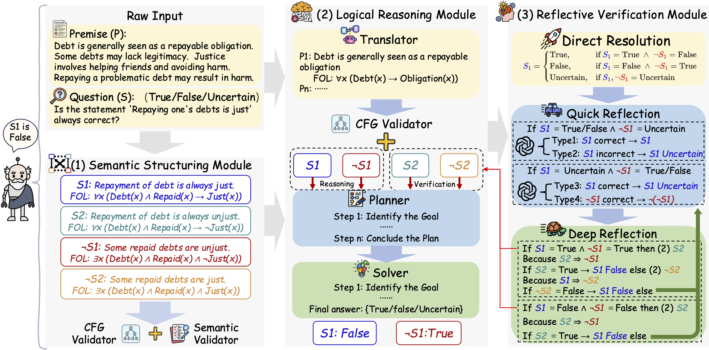
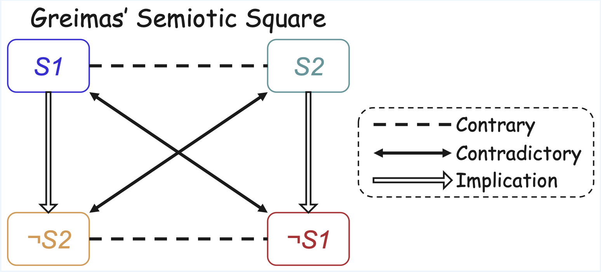

#  LogicAgent: From Ambiguity to Verdict

[](https://arxiv.org/abs/2509.24765)
[](https://opensource.org/licenses/MIT)


Official implementation of the paper: **"Semantic-Aware Logical Reasoning via a Semiotic Framework"**.

---

## 🌟 Overview

**LogicAgent** is a semiotic-square-guided framework designed to address the dual challenges of **logical complexity** and **semantic complexity** in LLM reasoning. 

Traditional logical reasoning systems often struggle with abstract propositions and ambiguous contexts. LogicAgent addresses this by:
1.  **Multi-Perspective Semantic Analysis**: Leveraging the **Greimas Semiotic Square** to map out logical relations.
2.  **Reflective Verification Pipeline**: Integrating automated deduction with structural verification to manage deeper reasoning chains.

### 📈 Highlights
**LogicAgent** achieves **State-of-the-Art (SOTA)** performance on logical reasoning benchmarks:

- **RepublicQA**: +6.25% improvement over baseline on our new benchmark coupling high semantic difficulty with logical depth
- **Mainstream Benchmarks**: +7.05% improvement on **ProntoQA, ProofWriter, FOLIO, and ProverQA**

---

## 🏗️ Framework & Theory

### 1. LogicAgent Pipeline
The agent operates through a multi-perspective structured reasoning process, ensuring that every verdict is grounded in both semantic clarity and logical consistency.

<p align="center">
  
</p>

### 2. Theoretic Foundation: Greimas Semiotic Square
LogicAgent utilizes the Greimas Square to navigate the semantic space of propositions, transforming linguistic ambiguity into a clear logical lattice.

<p align="center">
  
</p>

---

## 🚀 Getting Started

### 1. Preparation
- **Installation**:
  ```bash
  git clone https://github.com/AI4SS/Logic-Agent.git
  cd LogicAgent
  poetry install
  ```
- **Configuration**:
  LogicAgent is built on [MetaGPT](https://github.com/geekan/MetaGPT). Please follow the [official MetaGPT configuration guide](https://docs.deepwisdom.ai/main/en/guide/get_started/configuration.html) to set up your LLM (OpenAI, Ollama, etc.).

### 2. Run
1. Configure your target dataset in `utils/global_vars.py`:
   ```python
   DATASET_NAME = "RepublicQA" # Options: ProntoQA, ProofWriter, FOLIO, RepublicQA, ProverQA
   ```
2. Execute the reasoning agent:
   ```bash
   poetry run python3 main.py
   ```

### 3. Evaluation
Analyze the complexity and semantic diversity of the datasets or results:
```bash
poetry run python3 analyze/analyze.py
```

---

## 📂 Project Structure
```text
.
├── actions/      # Core implementation of the multi-perspective reasoning steps
├── analyze/      # Analysis scripts for evaluating results and dataset complexity
├── data/         # Logic benchmarks including RepublicQA
├── prompts/      # Prompt templates for different reasoning stages
└── main.py       # Main experiment execution script
```

---

## 📊 Dataset: RepublicQA
**RepublicQA** is a benchmark grounded in classical philosophical concepts, annotated through multi-stage human review. RepublicQA captures semantic complexity through abstract content and systematically organized contrary relations, achieving college-level reading difficulty (FKGL = 11.94) while maintaining rigorous logical reasoning.

- **Location**: `data/RepublicQA/all.json`
- **Size**: 600 entries

---

## 📝 Citation
If you find our work or code useful, please cite:

```bibtex
@misc{zhang2026semanticawarelogicalreasoningsemiotic,
      title={Semantic-Aware Logical Reasoning via a Semiotic Framework}, 
      author={Yunyao Zhang and Xinglang Zhang and Junxi Sheng and Wenbing Li and Junqing Yu and Yi-Ping Phoebe Chen and Wei Yang and Zikai Song},
      year={2026},
      eprint={2509.24765},
      archivePrefix={arXiv},
      primaryClass={cs.AI},
      url={https://arxiv.org/abs/2509.24765}, 
}
```

---

<p align="center">
  <i>"From Ambiguity to Verdict — Unfolding the logic within language."</i>
</p>
